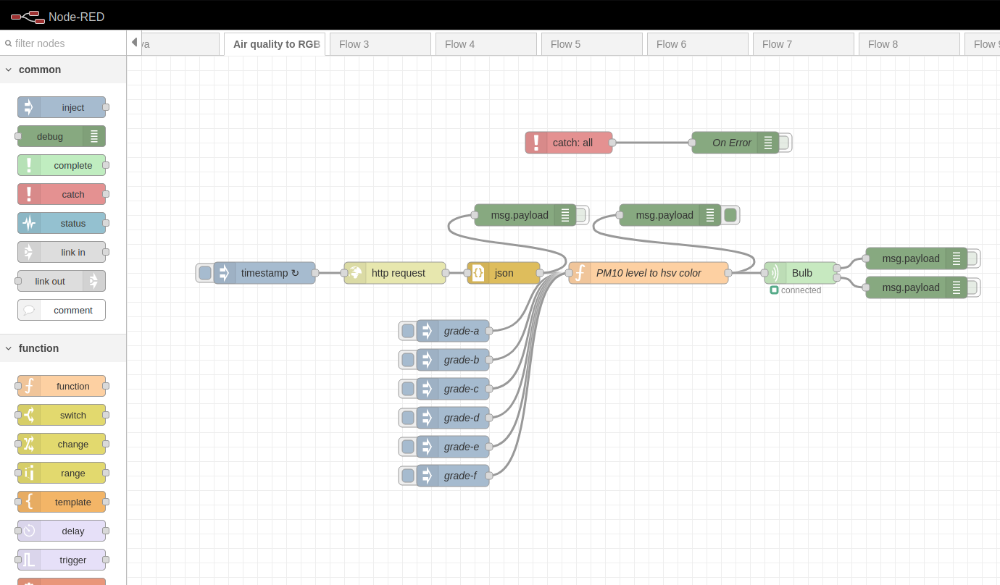

# Syngeos-air-quality-to-Tuya-RGB-bulb
Simple [Node-RED][1] flow that converts Tuya RGB bulb into air quality indicator.

The PM10[^1] level data is retrieved via the [syngeos API][2].
JS script selects the appropriate color depending on the concentration of PM10.
The color is sent to the bulb using a plugin [node-red-contrib-tuya-smart-device][3]

[^1]: PM10 is a mixture of airborne particles that do not exceed 10 micrometers in diameter.
According to WHO, the standard of the average daily concentration of this dust is 50 micrograms per cubic meter, and the annual standard is 20 micrograms per cubic meter. 
However, it is worth knowing that information about exceeded standards is announced when the daily PM10 concentration is 200 micrograms per cubic meter.

[1]: https://nodered.org/
[2]: https://api.syngeos.pl/api/public/data/device/1126
[3]: https://flows.nodered.org/node/node-red-contrib-tuya-smart-device
